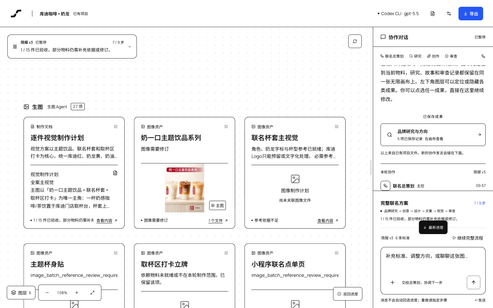
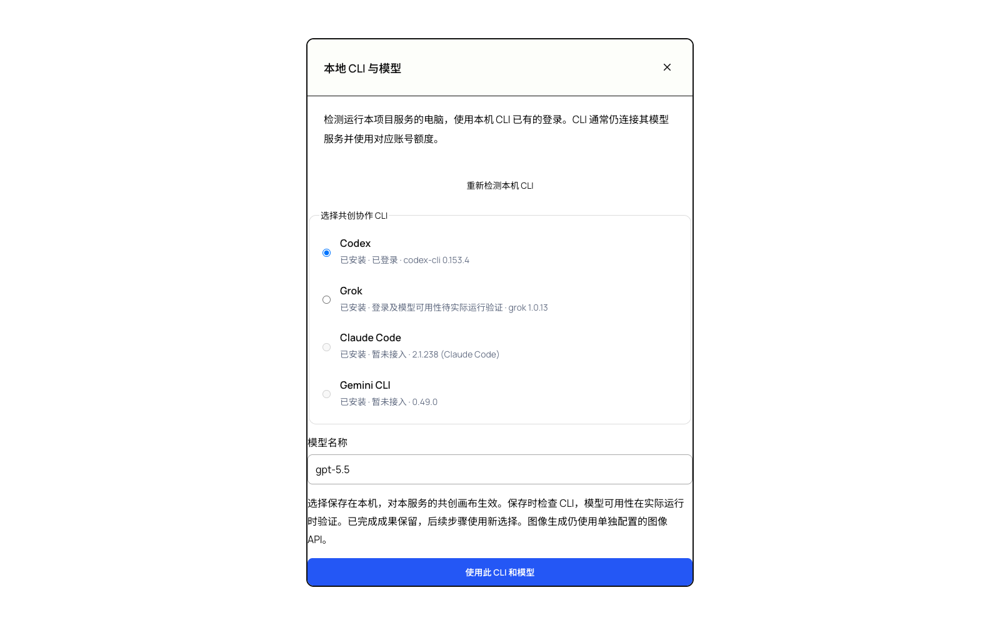
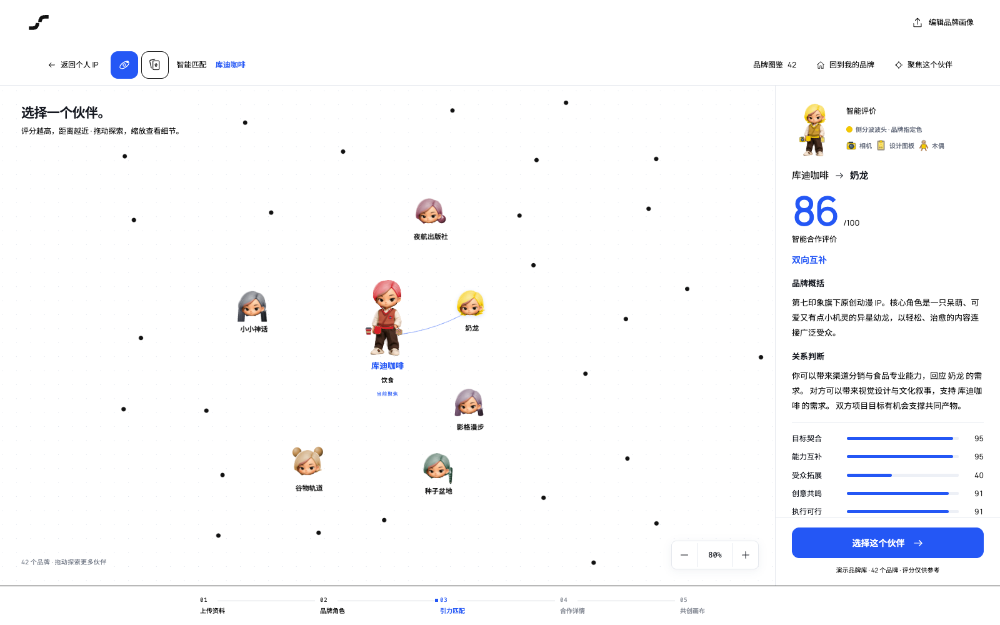

# Spark 火花

从找到合作伙伴，到把联名想法变成可讨论、可修改、可追溯的方案与视觉成果。

Spark 火花是一个**本地单用户品牌共创工作台**。你选择两个品牌、补充合作目标后，应用协调研究、创作和审查角色推进九步协作；方案、物料、图片与审查记录逐步加入同一张无限画布，可以继续对话修改并导出。

项目由品牌发现入口与共享共创工作台组成。代码目录及部分历史界面仍保留 Brand Relations、COLLIDER 名称；对外项目名称统一为 **Spark 火花**。



*2026-09-07 当前白色界面截图：库迪咖啡 × 奶龙实测会话。保留实际的 7/9 进度、1/15 件已验收及待修订状态；已执行到审查，但视觉与审查未全部通过。图片为 AI 概念探索，非官方联名发布。*

## 从这里开始

- [安装与启动](#安装与启动)
- [选择本地 CLI](#选择本地-cli)
- [配置真实生图](#配置真实生图)
- [从合作品牌到九步共创](#从合作品牌到九步共创)
- [全链路实测与当前限制](#全链路实测与当前限制)
- [数据、隐私与日志](#数据隐私与日志)
- [开发与项目结构](#开发与项目结构)

## 安装与启动

需要 Git、Node.js **24+**。真实文字协作需要本机已安装并登录的 Codex 或 Grok CLI；真实图片生成还需要你自己的图像服务及额度。克隆源码不会获得维护者的账号、密钥或本机会话。

在终端执行：

```bash
git clone https://github.com/gifted-professor/brand.git
cd brand
npm --prefix brand-collider-skills-design ci
cd brand-relations-demo
npx --yes pnpm@10.11.0 install --frozen-lockfile
cp .env.example .env.local
npx --yes pnpm@10.11.0 dev
```

打开 [Spark 火花](http://127.0.0.1:5174/)。如果端口被占用，以终端打印的地址为准。再次启动时，在 `brand-relations-demo/` 中运行最后一条命令即可。

先体验界面可以浏览内置品牌与渠道预演；也可以打开[空白共创画布](http://127.0.0.1:5174/canvas.html)，点击「填入演示品牌」，用「交互演示」体验固定内容。演示不发起真实模型请求，不代表新生成的方案或图片。

`.env.local` 只在服务端读取，修改后重启服务。发现入口会继承相邻工作台的配置，本入口同名项覆盖继承值，进程环境变量优先级最高。新用户通常只需配置 `brand-relations-demo/.env.local`。

## 选择本地 CLI

点击画布右上角的 **CLI / 模型名称**，检测并选择当前电脑的执行工具。

| CLI | 当前支持 |
| --- | --- |
| Codex | 检测安装、版本和登录状态；可选择执行共创流程 |
| Grok | 检测安装和版本；可选择执行，认证状态需在实际运行时验证 |
| Claude Code | 检测安装和版本，暂未接入执行 |
| Gemini CLI | 检测安装和版本，暂未接入执行 |

填写该 CLI 和账号支持的模型名称，点击「使用此 CLI 和模型」。保存时检查 CLI，不发送模型请求，也不保证该模型一定可用。Codex 未登录时先在终端运行 `codex login`。

选择会在本机保存并在服务重启后恢复。有任务运行时，需要先暂停并等待进程停止，再切换；已完成的成果保留。检测针对**运行项目服务的电脑**，不是任意访问网页的另一台电脑。

CLI 使用其已有登录，仍会连接对应的远程模型服务并使用账号额度。**CLI 选择影响共创研究、策划、设计与审查，不会替代图像 API。**



*检测结果仅代表截图电脑，其他电脑的安装和登录状态会不同。*

## 配置真实生图

目前没有图像服务配置弹窗，需要编辑 `brand-relations-demo/.env.local`。选择一个你有权使用的服务，填写：

```dotenv
# 文字协作使用本机 CLI；也可以启动后在画布选择。
COLLIDER_AGENT_TRANSPORT=codex-cli
CODEX_CLI_MODEL=gpt-5.5

# 图像服务使用自己的地址和密钥。
OPENAI_PROVIDER=openai-compatible
OPENAI_BASE_URL=https://your-image-service.example/v1
OPENAI_API_KEY=replace-with-your-key

# 当前图像适配器只接受 gpt-image-2。
IMAGE_MODEL=gpt-image-2
IMAGE_RESPONSES_MODEL=gpt-5.5
IMAGE_REASONING_EFFORT=auto
IMAGE_TIMEOUT_MS=780000
```

上面的地址与密钥是占位符，不能直接调用。`CODEX_CLI_MODEL` 和 `IMAGE_RESPONSES_MODEL` 分别属于文字 CLI 与生图请求的主模型，需按各自服务的实际支持调整；它们不必相同。

服务必须支持 **`POST /v1/responses`、流式响应及 `image_generation` 工具中的 `gpt-image-2`**。仅支持聊天接口或 `/images/generations` 的服务不能直接替换。模型列表中有同名模型，也不等于已支持完整生图链路。当前不能随意把 `IMAGE_MODEL` 改成其他图像模型。

配置后重启服务，再进入完整共创流程。具备图像与 CLI 素材检索能力时，应用会采集参考、绑定本轮物料、逐件出图并审查。图片服务未配置时，品牌入口的完整流程可生成文字方案与提示词；提示词和预加载图片不会被当作本轮实际出图。已经创建的仅文字会话不会因修改配置自动变成批量生图任务，请核对会话能力与提示。

已配置私人 CPA 的用户也可以使用 `OPENAI_PROVIDER=cpa`，由本机 remote-cpa helper 获取连接与凭证；这是可选接入方式，普通新用户不需要维护者的 CPA 配置。

密钥不要加 `VITE_` 前缀，也不要写进 README 或提交 Git。实际调用使用你配置的服务及其额度。

## 从合作品牌到九步共创

1. **准备品牌资料**：填写品牌介绍、已有能力、合作需求与目标。可上传文字、JSON、PDF、Word；单文件上限 8 MiB，扫描 PDF 没有 OCR，需要补充文字。
2. **选择合作品牌**：通过品牌发现、关系匹配或案例入口查看合作方，进入共创画布。建联操作是本地演示，不会发送邀约。
3. **启动完整方案**：点击「一键生成完整联名方案」。预加载渠道预演是参考展示；此按钮会创建或恢复独立的完整工作流会话。
4. **跟随进度并修改**：右侧显示九步及当前任务，左侧逐步呈现成果。完整入口支持自动选案；手动选案的会话会等待你选择方向。可以暂停、继续或补充标准。
5. **检查图片与审查意见**：查看物料范围、真实参考、生成文件和逐件验收结果。生成成功不等于验收通过；被阻塞的依赖可能使后续物料等待。
6. **导出与继续协作**：右上角「导出」下载当前方案与记录的 Markdown；图片等文件从画布素材入口查看、下载。再次进入已有项目可恢复会话。

| 步骤 | 工作内容 |
| --- | --- |
| 1 | 品牌 A 研究 |
| 2 | 品牌 B 研究 |
| 3 | 提出创意初稿 |
| 4 | 比较并收敛方向 |
| 5 | 深化产品与体验 |
| 6 | 统一设计与物料清单 |
| 7 | 完成传播文案 |
| 8 | 规划视觉与单件效果图，按配置执行物料制作 |
| 9 | 审查并汇总交付 |

九步由六个专业 Skill 支撑：品牌研究、联名创意、设计规格、传播文案、视觉制作和质量审查。双方研究可并行；九步不是九张图片，物料数量取决于清单及本轮范围。

画布支持拖动、缩放、图层显隐和成果定位。点选成果可以继续讨论；补充要求会更新简报版本与受影响阶段。「查看全部成果」用于找回画布中的内容，「同步最新成果」用于刷新已有记录。



*角色为品牌能力可视化形象，评分为演示参考，不代表官方角色形象或已确认合作。*

## 全链路实测与当前限制

**2026-09-07，库迪咖啡 × 奶龙**使用本机 Codex CLI / `gpt-5.5` 进行真实协作，图像经已配置的 CPA / `gpt-image-2` 生成。实测覆盖完整会话恢复、品牌研究、创意与设计、真实素材采集、逐件生图、第九步审查、暂停恢复和 Markdown 导出。

| 实测项 | 结果 |
| --- | --- |
| 方案与物料清单 | 保存 24 项候选，其中 15 项纳入本轮、9 项可选项未制作 |
| 真实生图 | 生成 3 张图片 |
| 逐件验收 | 取杯口提示贴通过；主题饮品需修订；随杯小卡待核实 |
| 未完成物料 | 7 项阻塞，5 项等待上游验收，尚未生成 |
| 最终状态 | 保留为部分完成、需修订；没有把整轮标成全部通过 |
| 导出 | 当前方案与记录成功导出 |

这证明流程能到达真实生图、审查和导出，**不代表 15 件物料全部交付，也不保证任意品牌组合都会一次成功**。源码含演示素材；这轮实测的完整会话、原图与原始日志仅保存在本机，不随克隆提供。

实测已修复长时间停留 0/9 时诊断不足、CLI 代理变量传递、Codex 输出 Schema 兼容、制作范围校验、已知代理 DNS 识别和透明 PNG 展示转换超限等问题。当前仍有以下限制：

- 单次最多 4 张参考图。身份参考和上游图片合计超限时会阻塞，尚无完整的自动缩减参考机制。
- 品牌身份、角色准确性和披露文字仍需逐件审阅，不能仅以“图片生成成功”判断可用。
- 部分“等待审查”实际表示等待上游图验收；未核实证据的归档与跨标签同步仍需改善。
- 预置头像描述可能混入品牌资料，应核对官方角色身份依据。
- 图像模型选择、服务连接测试尚无界面入口；CLI 安装状态不能代替模型权限与网络验证。

2026-09-07 的 CLI 选择版本，两项目共 657 项自动化测试、构建及宿主 lint 通过；随后新增的损坏配置恢复用例与 CLI 专项共 6 项通过，类型检查通过。测试通过不代表所有生成内容已验收。

## 数据、隐私与日志

主入口运行数据位于 `brand-relations-demo/outputs/`：

| 位置 | 内容 |
| --- | --- |
| `collider-sessions/` | 会话、成果与 `local-cli.json` 选择配置 |
| `collider-cli-agents/` | CLI 调用工作目录和执行诊断；新选择的 CLI 可增加工具名子目录 |
| `collider-images/` | 实际图片与生成元数据 |

排查 0/9 时，先看右侧当前任务及错误，再检查 CLI 是否登录、模型是否受当前版本支持、网络是否可达。主控准备阶段尚未完成时也可能显示 0/9，不能只看计数判断进程是否卡死。

每次调用的 `activity.json`、`execution.json` 提供阶段、时间与执行状态。活动日志采用受限元数据记录，不保存原始 CLI 输出；**调用目录中的任务输入、成果及其他文件仍可能包含你的品牌资料**，分享日志前应检查内容。不要上传整个输出目录或本机认证文件。

`.env.local` 和 `outputs/` 默认不被 Git 跟踪；CLI 选择只保存工具 ID 与模型名，不复制登录凭据。实际模型请求仍会把必要的任务资料发送给你选择的服务。

本仓库已有研究资料中的本机路径、飞书案例库记录及文档标识，不能视为完全没有内部信息的空白模板。2026-09-07 常见密钥特征检查未检出真实密钥，但不构成对全部文档、二进制附件及历史内容的保密保证。

当前服务面向本机单用户，没有多用户账号、租户隔离或完整后台任务基础设施。主入口依赖 Node 服务端接口，**只部署 `dist/` 静态文件不能运行完整共创功能**。

## 开发与项目结构

```text
brand-relations-demo/          品牌发现入口、宿主接口与共创画布入口
brand-collider-skills-design/  共享工作台、运行时、CLI 与图像适配器
brand-case-research/           可追溯案例研究与检索工具
品牌物料/                     案例资料及证据库
docs/                         接入记录、说明与历史截图
```

在仓库根目录检查：

```bash
npm --prefix brand-collider-skills-design test
npm --prefix brand-collider-skills-design run build
npm --prefix brand-relations-demo test
npm --prefix brand-relations-demo run build
npm --prefix brand-relations-demo run lint
```

共享工作台也可独立运行，配置使用它自己的 `.env.local`：

```bash
cd brand-collider-skills-design
cp .env.example .env.local
npm ci
npm run dev
```

开发入口为 [5173](http://localhost:5173)，API 为 4318。独立工作台执行 `npm run build` 后可用 `npm start` 在 [4318](http://localhost:4318) 提供网页与 API。两入口共享代码，但会话存储分别维护。

更多资料：

- [品牌发现入口说明](brand-relations-demo/README.md)
- [共享工作台说明](brand-collider-skills-design/README.md)
- [集成来源与历史验证](docs/BRAND_RELATIONS_MERGE.md)
- [物料策划方法](brand-collider-skills-design/docs/MATERIAL_PLANNING.md)
- [图像适配技术说明](brand-collider-skills-design/docs/IMAGE_API.md)
- [案例研究工具](brand-case-research/SKILL.md)

品牌发现模块来自 [KAI-NEX/brand-relations-demo](https://github.com/KAI-NEX/brand-relations-demo)，保留其 [MIT 许可证](brand-relations-demo/LICENSE)。历史设计文档描述的是各阶段设计，不代表其中所有能力已经实现；当前操作以本文与实际界面状态为准。
