# 碰撞 COLLIDER · 品牌联名创作工作台

把两个品牌的资料、联名方向、设计、文案和视觉成果，放进同一个可以持续讨论的工作空间。

COLLIDER 面向品牌策划、创意与设计协作：从合作目标出发，由应用主控协调研究、创作与审查角色，使用六个专业 Skill 推进方案。用户在右侧持续补充要求，在左侧无限画布查看、整理和追溯每一阶段的成果。

项目同时包含可追溯的品牌合作案例库、案例检索工具，以及图片生成与已有制作物料接入能力。当前定位为 **本地单用户工作台**。

联名适配通过六个 Skill 共用的 [开放品类方法](brand-collider-skills-design/.claude/skills/brand-profile/references/CATEGORY_ADAPTATION.md) 推导：从业务、产品线和用户场景拆解可设计部位及体验，再发散主营、邻近与探索产物。它不依赖品牌名单；具体行业示例按需参考，方法全文会进入实际模型上下文。

六个原始 Skill 的 1.5.0 版加入 [真实素材依据](brand-collider-skills-design/.claude/skills/brand-profile/references/VISUAL_EVIDENCE.md)：从研究阶段并行采集来源图片，逐件绑定真实参考，生成后对照身份与设计。[本地执行方法](brand-collider-skills-design/.claude/skills/visual-production/references/LOCAL_EXECUTION.md) 提供可复用采集器和最多 4 并发的批量生成、检查与恢复；网页单图入口的接入范围见 [工作流说明](brand-collider-skills-design/docs/AGENT_WORKFLOW.md)。

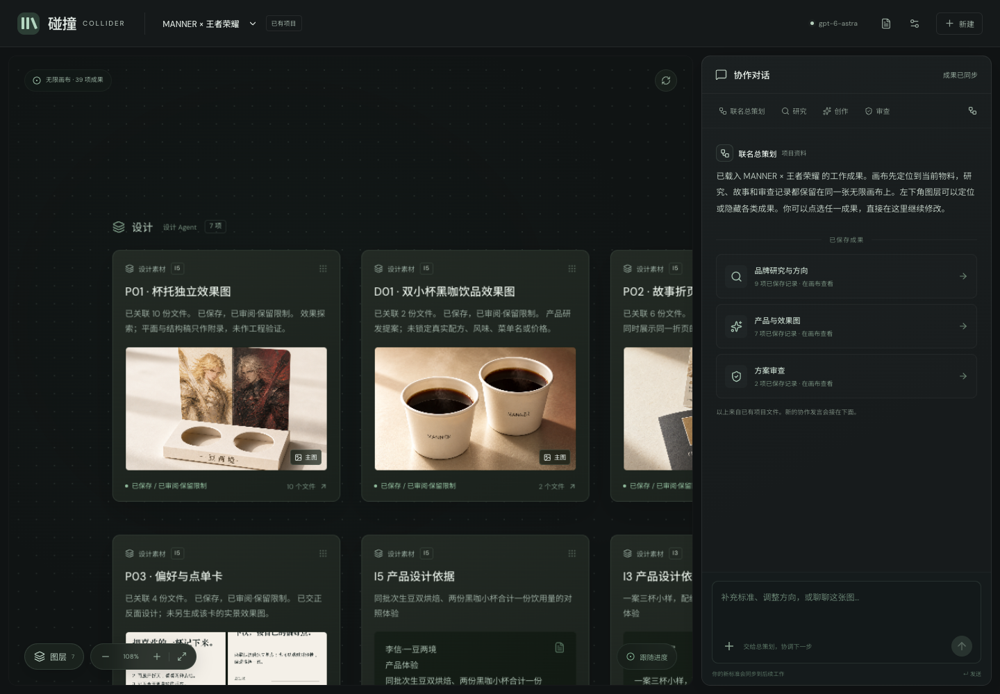

*实际页面截图：MANNER × 王者荣耀概念探索项目，读取本机已有制作文件。图中为 AI 概念设计与效果探索，非官方联名发布；具体选案、审查和制作状态以节点记录为准。*

## 内容导航

- [项目能做什么](#项目能做什么)
- [界面与完整使用流程](#界面与完整使用流程)
- [六个专业 Skill](#六个专业-skill)
- [案例库与研究工具](#案例库与研究工具)
- [快速启动](#快速启动)
- [模型配置与图片生成](#模型配置与图片生成)
- [架构与数据保存](#架构与数据保存)
- [项目目录](#项目目录)
- [当前边界](#当前边界)
- [检查与文档索引](#检查与文档索引)

## 项目能做什么

| 能力 | 实际使用方式 |
| --- | --- |
| 品牌资料整理 | 分别填写两个品牌的名称、介绍和可用资源，上传文字、PDF 或 Word 资料 |
| 联名方向探索 | 研究双方品牌，形成三个可供选择的方向，选定后继续深化 |
| 持续协作 | 在同一对话里补充标准、调整方向、暂停或继续；记录角色、阶段和实际使用的方法 |
| 无限成果画布 | 成果逐步出现并保留；支持拖动、缩放、图层显隐、定位、进度跟随与整体鸟瞰 |
| 完整成果查看 | 从卡片打开原文、媒体、来源和依赖，围绕具体节点继续讨论 |
| 方案与视觉制作 | 以主营产品为核心展开物料候选，逐件查看设计与视觉提示词；满足条件后由用户触发主图生图 |
| 已有制作项目 | 读取已接入项目的文档、图片、媒体和物料清单，展示文件状态并支持下载 |
| 研究资料复用 | 独立维护案例来源、断言和差异，通过命令行检索并导出任务资料包 |
| 本地保存与导出 | 保存会话及阶段结果，恢复历史项目，导出方案与对话 Markdown |

## 界面与完整使用流程

当前页面统一为 **左侧画布 + 右侧协作对话**。项目资料、历史和工作方法在原页打开，研究到审查的成果始终留在同一张画布中。

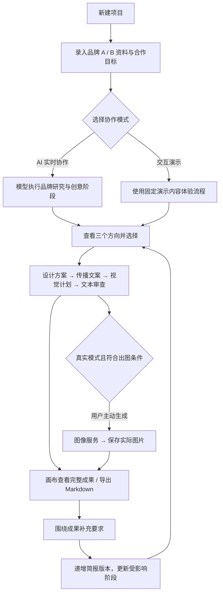

*图中概括一般修改流程；明确只改文案时，保留已选方向与统一设计，更新文案及其后续阶段。*

### 1. 新建一个联名项目

新项目从空画布开始。右侧依次添加品牌 A、品牌 B 和合作目标。想先体验界面，可以点击「填入演示品牌」，确认模式为「交互演示」，再开始协作。

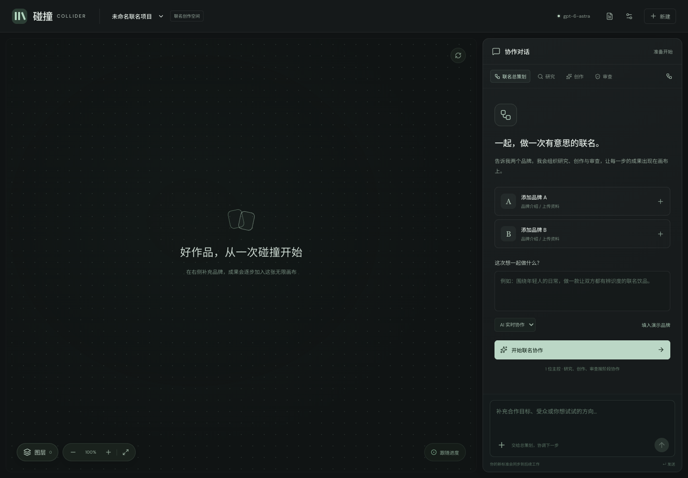

演示使用虚构的「早八咖啡 × 留白书店」，适合了解交互，不需要发起真实模型请求。以下流程截图中的演示草稿均为固定占位内容。

### 2. 补充品牌与合作简报

点击品牌入口填写介绍、用户群体、现有资源和约束，并上传补充资料。建议把目标写成具体任务，例如「让咖啡与主题阅读形成关联，增加周末到店」，同时说明可用触点、不能新增的物料和待确认事项。

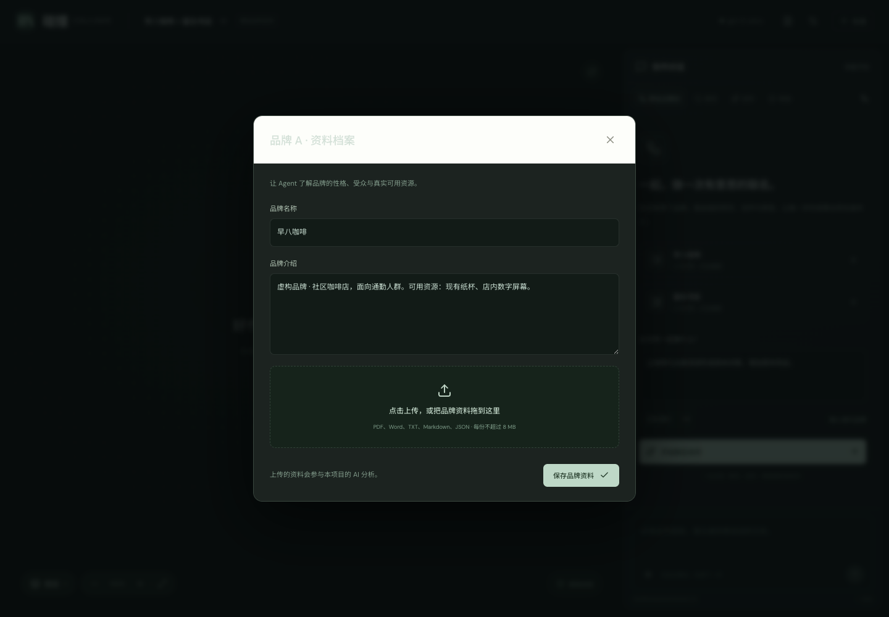

支持 `.txt`、`.md`、`.json`、`.pdf`、`.docx`，单文件上限 **8 MiB**，提取文本上限 **12 万字符**。文本文件使用 UTF-8，JSON 需语法有效。PDF / Word 当前主要提取文本，扫描件没有 OCR，图片与复杂排版中的重要信息需要补充说明。

### 3. 研究品牌，选择方向

开始协作后，右侧显示阶段交接和公开成果；左侧逐步加入品牌解读与创意节点。三个方向准备好后，在右侧选择一个继续深化。

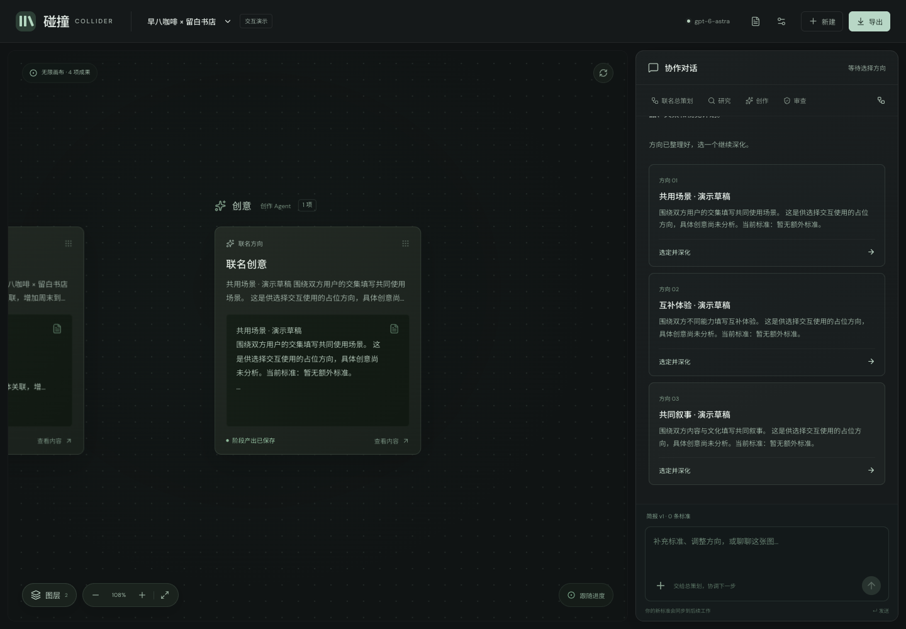

当前应用按预设阶段调用同一配置的模型，并记录专业角色与品牌视角。公开记录包含阶段目标、Skill 和提交结果，不展示模型私有推理。

### 4. 查看完整方案，持续提出修改

方向选定后，继续形成设计、文案、视觉计划和审查成果。点击「查看全部成果」可鸟瞰整个项目；点击卡片打开完整内容。

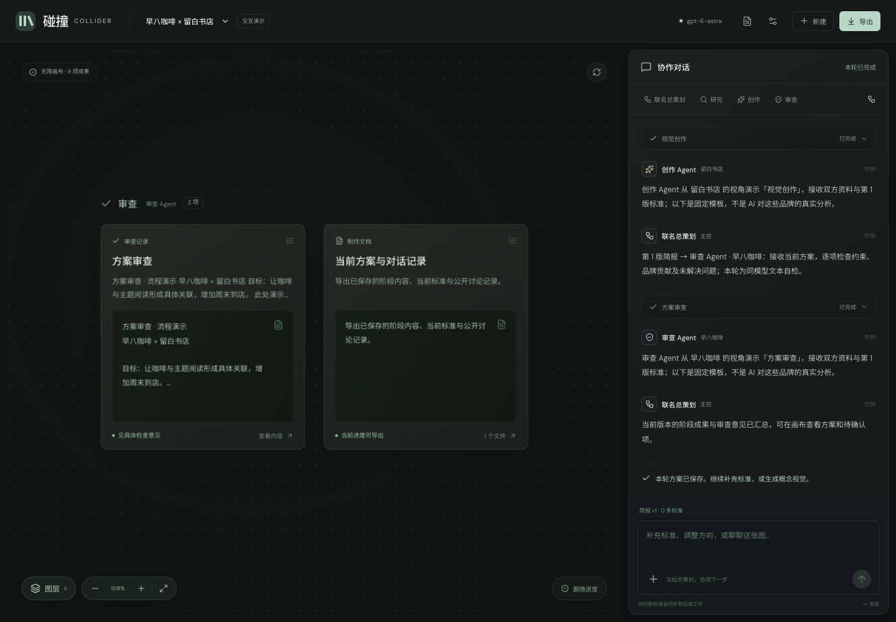

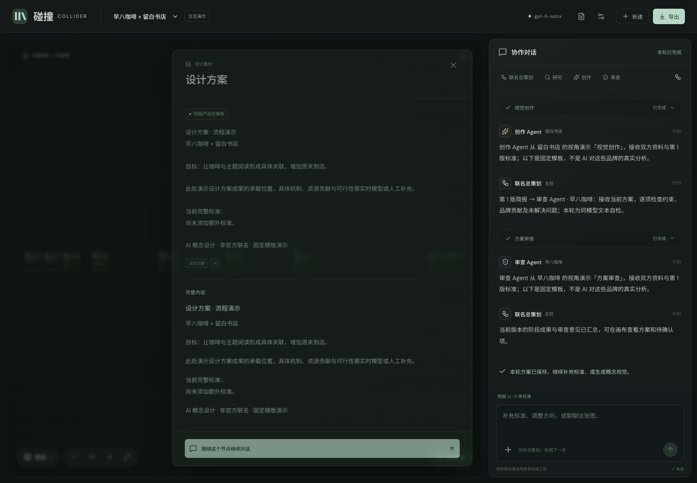

在底部输入框提交新标准，例如「双方的贡献都要在方案中体现」。也可以在详情中点击「围绕这个节点继续对话」，把该成果作为参考上下文。应用将新要求与来源资料分别保存，按新版本继续工作。

普通修改会重新进入创意阶段；明确只改宣传语等文案要求时，可以保留方向和设计。运行中的旧版本结果不会覆盖新版本。暂停会在当前步骤返回后停止派发下一步。

### 5. 查看制作物料与实际图片

已有制作项目可把研究、故事、物料、传播图、视频筹备和审查记录一起载入画布。当前接入的样板是 **MANNER × 王者荣耀**，包含杯托、双小杯饮品、故事折页、传播海报等已有文件。

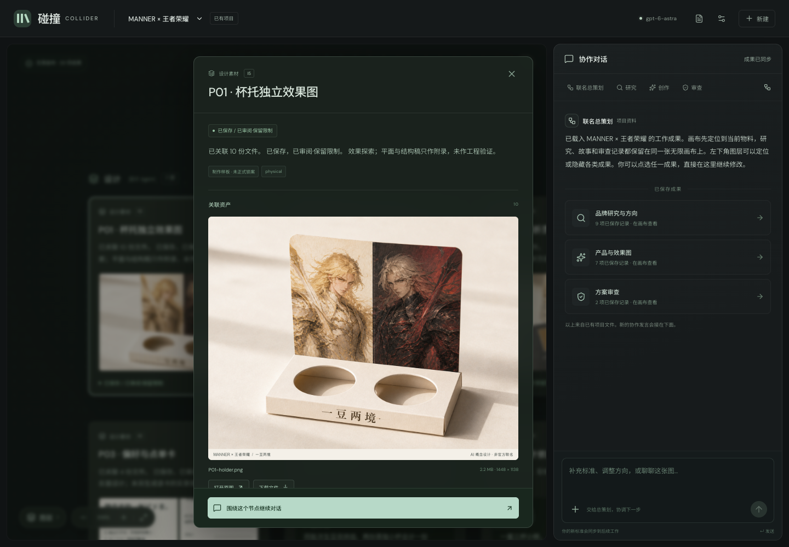

节点详情展示主图、附属文件、上下游依赖、来源和下载入口。「已保存」「已审阅·保留限制」「待制作」等状态分别表达文件存在与审查进度。视频脚本和分镜属于筹备资料，只有实际视频文件存在并通过文件校验时才显示播放器。

本机已有样板文件时，可打开 [制作项目](http://localhost:5173/?view=production&project=manner-hok-20260905)。这些文件位于被 Git 忽略的 `outputs/` 中，单独克隆源码不会自动获得完整样板素材；本 README 的截图已单独保存，可随仓库查看。

### 6. 用图层组织长期项目

左下角「图层」提供研究、创意、设计、文案、生图、视频与审查分类。点击名称定位，点击眼睛切换显隐，展开分类查看具体成果。卡片位置与视角按项目保存在当前浏览器。

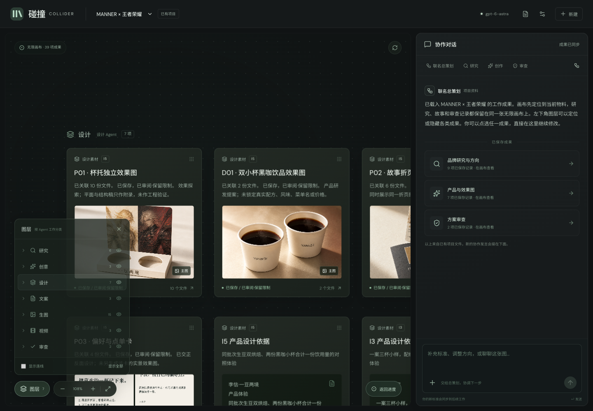

拖动画布空白处平移；按住 Command / Control 滚轮缩放，也可使用缩放按钮。手动浏览后点击「返回进度」恢复自动跟随。已有项目支持同步来源文件，新物料会进入画布。

小屏幕采用上方画布、下方对话的布局，两部分各自滚动。

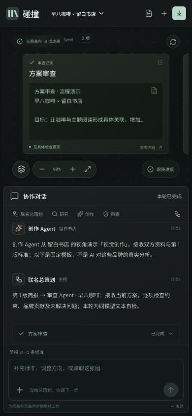

## 六个专业 Skill

项目将创作方法存放在受信任的 Skill 文件中。运行时读取当前阶段需要的方法与参考资料，并在会话中固定版本和内容摘要。

| Skill | 职责 | 主要交付 |
| --- | --- | --- |
| `brand-profile` | 品牌研究 | 品牌特征、双方资源、来源声明、信息缺口 |
| `collab-ideation` | 联名创意 | 合作机制、方向与取舍依据 |
| `design-spec` | 设计方案 | 产品与视觉设定、物料外观、统一设计稿 |
| `campaign-copy` | 传播文案 | 故事主线、逐件文案与视频叙事筹备 |
| `visual-production` | 视觉制作 | 物料计划、提示词、视觉素材制作方法 |
| `quality-review` | 质量审查 | 对照约束检查完整性、一致性与未确认事项 |

Skill 源码位于 [`.claude/skills/`](brand-collider-skills-design/.claude/skills/)。六个 Skill 是专业方法，由主控按阶段使用。

创意方法文件已包含「十二候选评审、最多三个成熟方案」的赛马规则。网页已接入以核心产品、内容或服务为中心的物料候选清单、逐件视觉提示词、画布与导出；支持双方品牌共同开发，品类开放，可按咖啡、3C、首饰、鞋服、美妆、家居或数字服务等实际业务展开。默认充分探索约 20–30 个适配项目，并服从用户范围和资源限制；服务不强制配实体周边，角色或尺寸变体单列。**网页运行时仍采用两方输入、固定阶段和三个方向校验**，尚未完整自动编排十二进三、独立冷评或逐件批量生图；开放品类不等于所有组合已实际验证。详见 [物料策划说明](brand-collider-skills-design/docs/MATERIAL_PLANNING.md)、[67 个案例的合作产物研究及首饰补充例](brand-collider-skills-design/docs/COLLABORATION_PRODUCTS.md)、[赛马方法](brand-collider-skills-design/.claude/skills/collab-ideation/references/TOURNAMENT.md) 与 [制作包方法](brand-collider-skills-design/.claude/skills/visual-production/references/CAMPAIGN_KIT.md)。

## 案例库与研究工具

`brand-case-research/` 负责整理历史品牌合作案例，保留资料来源、可核验断言、方法解释和冲突。资料位于 `品牌物料/案例库/`，原始报告与 CSV / JSON 也保留在 `品牌物料/` 中。

2026-09-05 本次本地校验：**67 个案例、69 条来源记录、40 条方法记录、8 条冲突记录**。来源记录数不等于独立证据数量，案例数也不表示已全部核验。

在仓库根目录执行，工具只依赖 Python 3：

```bash
# 检查库结构与引用
python3 brand-case-research/scripts/case_library.py validate 品牌物料/案例库/library.json

# 按任务检索案例
python3 brand-case-research/scripts/case_library.py query 品牌物料/案例库/library.json \
  --query "咖啡 数字内容 到店" --limit 5

# 导出给创意阶段使用的研究资料包
python3 brand-case-research/scripts/case_library.py packet 品牌物料/案例库/library.json \
  --query "咖啡 数字内容 到店" --consumer collab-ideation --limit 5 \
  --output research-context.json
```

研究包目前独立生成，网页尚未自动接入案例检索。历史案例用于参考合作机制；当前品牌的资源、预算与授权仍需单独确认。

相关入口：[案例索引](品牌物料/案例库/案例索引.md) · [使用说明](品牌物料/案例库/使用说明.md) · [资料消费接口](brand-case-research/references/consumer-contract.md)

## 快速启动

需要 **Node.js 24+** 与 npm。以下命令均在仓库根目录执行：

```bash
npm --prefix brand-collider-skills-design ci
npm --prefix brand-collider-skills-design run dev
```

打开 [http://localhost:5173](http://localhost:5173)。开发模式同时启动 Vite 前端与 Node API，前端把 `/api` 请求代理到 `127.0.0.1:4318`。

首次使用可以直接选择「交互演示」。真实模式另需配置文本服务，见下一节。

构建后由 Node 提供网页和 API：

```bash
npm --prefix brand-collider-skills-design run build
npm --prefix brand-collider-skills-design start
```

打开 [http://localhost:4318](http://localhost:4318)。启动前关闭占用同一 API 端口的开发服务。

## 模型配置与图片生成

配置模板是 [`.env.example`](brand-collider-skills-design/.env.example)，本地配置文件为 `brand-collider-skills-design/.env.local`。新环境可复制模板后填写；已有本地配置时保留原文件。配置由服务端读取。

| 配置项 | 用途 |
| --- | --- |
| `OPENAI_PROVIDER` | `cpa` 使用本机 remote-cpa helper；`openai-compatible` 使用显式网关配置 |
| `OPENAI_BASE_URL` / `OPENAI_API_KEY` | 使用兼容网关时填写自己的服务地址与凭证 |
| `OPENAI_MODEL` | 文本模型；当前示例为 `gpt-6-astra` |
| `TEXT_MAX_TOKENS` / `TEXT_TIMEOUT_MS` | 文本输出预算与超时，默认 16384 / 180000 ms |
| `TEXT_REASONING_EFFORT` | 文本推理强度，默认 `low` |
| `IMAGE_RESPONSES_MODEL` | 图片请求的 Responses 编排模型，示例为 `gpt-6-astra` |
| `IMAGE_MODEL` | 图像模型，示例为 `gpt-image-2` |
| `IMAGE_TIMEOUT_MS` / `IMAGE_OUTPUT_DIR` | 图像请求超时与保存位置 |

CPA 模式需要另行安装并配置本机 remote-cpa helper；它不是仓库 npm 依赖，凭证由 helper 读取到内存。兼容网关模式需使用支持所需文本或 Responses 图像能力的服务。模型可用性取决于实际网关，配置名称本身不代表调用成功。

网页出图需要用户明确触发，并满足选案和出图前文本自检条件。也可独立使用生图 CLI：

```bash
# 检查连接与模型列表
npm --prefix brand-collider-skills-design run image:check

# 实际生成图片，会调用上游服务并可能计费
npm --prefix brand-collider-skills-design run image:generate -- \
  --prompt "米白色陶瓷杯，暖灰背景，柔和棚拍光，无文字" --ratio 1:1
```

图片和元数据保存到工作台 `outputs/images/`。超时或断流时应先检查任务状态与已保存文件，避免重复请求。更多配置见 [Image API 说明](brand-collider-skills-design/docs/IMAGE_API.md)。

## 架构与数据保存

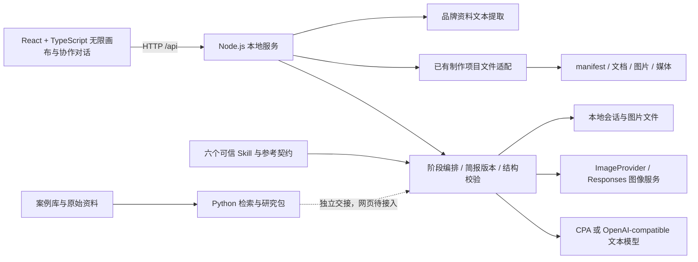

前端使用 React 19、TypeScript、Vite 与 Lucide 图标；后端使用 Node.js，PDF / DOCX 文本提取分别使用 `pdf-parse` 与 `mammoth`。前后端共享会话与方案类型。

| 数据 | 保存位置 / 行为 |
| --- | --- |
| 会话、品牌提取文本、消息、阶段成果、Skill 快照 | `brand-collider-skills-design/outputs/sessions/` |
| 生成图片与元数据 | `brand-collider-skills-design/outputs/images/` |
| 已有 MANNER 项目制作文件 | 根目录 `outputs/manner-hok-20260905/` |
| 画布坐标、视野、图层显隐 | 当前浏览器，按项目保存 |
| 案例库 | `品牌物料/案例库/library.json` |
| README 页面截图 | `docs/screenshots/`，可随仓库保存 |

会话采用临时文件写入后替换的方式保存。重启时未完成任务恢复为暂停，由用户继续。简报新版本会使过期的异步结果失效。`outputs/` 和 `.env.local` 不纳入 Git；迁移项目时，运行数据需要另行备份。

## 项目目录

```text
brand/
├── README.md                         # 项目总览与截图导览
├── docs/screenshots/                  # 可随仓库查看的实际页面截图
├── brand-collider-skills-design/      # 网页工作台与模型服务
│   ├── web/                          # 界面、画布与会话成果映射
│   ├── src/server/                   # HTTP API、阶段运行时、制作文件接入
│   ├── src/                          # 共享类型与图像服务实现
│   ├── .claude/skills/                # 六个专业 Skill
│   ├── contracts/                    # 完整产物契约设计参考
│   ├── scripts/                      # 生图 CLI 与方法包校验
│   ├── tests/                        # 运行时、接口及画布逻辑测试
│   ├── docs/                         # 交互、架构与模型配置说明
│   └── outputs/                      # 本地运行数据，Git 忽略
├── brand-case-research/               # 案例研究方法与 Python 工具
├── 品牌物料/                          # 原始资料、案例库与来源记录
└── outputs/                          # 项目制作成果，Git 忽略
```

## 当前边界

- **本地应用**：没有账户体系、跨用户隔离、数据库任务队列或可靠多进程 worker。
- **固定阶段编排**：专业角色按顺序调用配置模型，尚未实现独立 Codex 子 agent 自动调度、并行研究或独立模型审查。
- **研究输入**：网页没有自动联网核验和案例库自动检索；输入资料与历史案例都需要结合来源判断。
- **制作状态**：视觉计划、已生成文件和图片内容审查分别记录；同模型文本自检通过不等于图像、授权或生产验收通过。
- **视频与生产文件**：已有媒体可以预览，但完整视频自动生成、模板海报渲染和可直接量产的生产文件输出尚未实现。
- **完整契约**：当前使用简化会话结构，技术设计中的全部产物 Schema、MCP 工具协议与业务守卫尚未全部落地。

## 检查与文档索引

常用检查命令：

```bash
npm --prefix brand-collider-skills-design run typecheck
npm --prefix brand-collider-skills-design test
npm --prefix brand-collider-skills-design run build

# 方法包校验额外需要 PyYAML
cd brand-collider-skills-design
python3 scripts/validate_bundle.py
```

本次 README 制作实际走通了浏览器演示流程：新建 → 品牌资料 → 三方向选择 → 方案完成 → 成果详情；同时读取已有制作项目拍摄物料与图层截图，并执行案例库校验。未为拍摄新增真实文本、生图或视频调用。截图日期为 **2026-09-05**，桌面视口 **1440 × 1000**，小屏视口 **390 × 844**。详见 [截图清单](docs/screenshots/README.md)。

| 文档 | 内容 |
| --- | --- |
| [统一工作空间](brand-collider-skills-design/docs/UNIFIED_WORKSPACE.md) | 当前交互与画布行为，优先于早期页面划分 |
| [角色与阶段交接](brand-collider-skills-design/docs/AGENT_WORKFLOW.md) | 主控、角色、版本与成果交接机制 |
| [工作台详细说明](brand-collider-skills-design/docs/WORKBENCH.md) | 上传、运行、状态与历史验证记录 |
| [制作项目接入](brand-collider-skills-design/docs/PRODUCTION_CANVAS.md) | 清单、素材顺序、文件与媒体适配 |
| [Image API](brand-collider-skills-design/docs/IMAGE_API.md) | 图片参数、CLI、凭证与错误处理 |
| [技术设计](brand-collider-skills-design/TECHNICAL_DESIGN.md) | 完整架构设计参考，包含尚未实现部分 |
| [产物契约](brand-collider-skills-design/contracts/CONTRACTS.md) | 产物结构与业务规则设计 |
| [历史检查记录](brand-collider-skills-design/CHECKS.md) | 对应版本的实际检查证据 |
| [案例研究方法](brand-case-research/SKILL.md) | 案例整理、检索与证据维护 |
