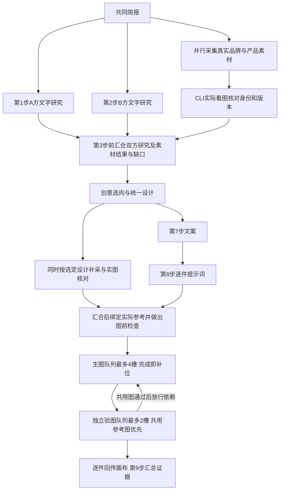

# 画布中的角色与阶段交接

项目采用一个主控入口，由宿主按依赖安排研究、创作与审查三类专业任务。品牌 A / B 是任务关注的品牌视角，与专业角色分别记录。所有阶段读取同一会话的目标、完整当前标准、采用方向和当前关联成果，再按职责读取必要的品牌资料与前序有效成果。用户只提供两个品牌名也可开始；描述、附件和目标为选填，缺目标时采用默认探索目标。

## 当前六个 Skill 的映射

| 专业角色 | 当前 Skill | 实际任务 |
| --- | --- | --- |
| 主控：联名总策划 | 宿主运行时 | 按固定阶段依赖生成交接记录、维护版本、处理暂停与修改、汇总成果；交接不调用模型 |
| 研究 Agent | `brand-profile` | A / B 并行独立研究；自动路径同时采集两方真实素材并用 CLI 附图核对 |
| 创作 Agent | `collab-ideation` | 提出并收敛方向，按推荐顺序提交；默认由主控采用首项继续 |
| 创作 Agent | `design-spec` | 深化选定方向，统一双方设计 |
| 创作 Agent | `campaign-copy` | 依据统一设计形成故事与传播文案 |
| 创作 Agent | `visual-production` | 提交逐件计划与提示词；自动路径由宿主绑定参考、最多四并发制作及逐件验收 |
| 审查 Agent | `quality-review` | 出图前自检、逐件实际图像核查及第九步证据汇总；同模型任务不称独立评审 |

这些映射沿用现有六个 Skill 身份与工具契约，规则版本为 1.6.1：资料稀少不阻断文字概念；需要准确品牌身份的视觉，必须以真实素材和实际附图为依据。运行时把 `agent/SYSTEM.md`、六个 Skill 及共享 `VISUAL_EVIDENCE.md` 正文纳入内容哈希，不能只加载链接。每个会话使用固定快照；主动刷新研究时新版本采用当前方法，并保留旧版本快照。本次没有改名或迁移完整业务契约。

## 真实素材在哪个阶段进入

主控在研究开始时分派素材采集支线，与第 1–2 步文字研究并行，先收双方通用 Logo、产品结构/实拍与相关身份资产。进入第 3 步创意提出前，先汇合初始采集与实际核对结果或局部缺口，让创意直接读取真实素材依据；缺图不阻止文字创作。选定方向后只补当前需要的角色、服装版本、符号或产品型号，不能混用不同活动/版本。网页搜索结果只是线索，必须回到来源页、下载实际图像、查看其内容，才进入本轮参考清单。来源可信、已查看、实际附图、输出身份正确分别记录。

采集不必等待完整方案，也不成为所有任务的全局阻断：需要某个准确身份但参考未齐的图等待补图，其余独立工作继续。先完成必须共用的产品/角色基准图，再让依赖它的任务读取真实文件；没有这种依赖的物料可直接并行。具体方法与附件字段维护在原始 [VISUAL_EVIDENCE.md](../.claude/skills/brand-profile/references/VISUAL_EVIDENCE.md)，不复制各次项目的品牌素材到通用规则。

具备文件和视觉能力的本地 Agent 可用原 Skill 采集脚本和 `image-cli.ts batch` 执行这条链。批量执行使用一个清单、一个状态文件，最多 4 个在途任务，逐件落盘；源图变动不能偷偷复用旧状态；失败与未知计费结果不会自动重发。批量执行状态不是视觉审核结论。

网页实时模式的“开始联名协作”现在显式提交 `autoProduce: true`。宿主从研究开始并行执行双方素材发现、真实来源页/原图下载和 CLI 附图核对，第 3 步前汇合初始结果与缺口；第 6 步统一设计提交后即按计划补采，与文案及逐件提示词制作并行；第 8 步汇合后完成参考绑定与出图前检查，再调用同一批量执行器。Grok 用 ACP 图像内容块、Codex 用 `--image` 真正传图，Agent 不取得任意文件或执行权限。

自动路径默认制作 core 与 recommended，optional 留在候选清单。独立就绪项立即启动，不等凑齐四项；在途最多四个，空槽立即补下一个。结果返回后逐件保存并实际附图审查，通过的共用图才开放给依赖项，第 9 步汇总真实输出、附图、来源和验收证据。网页持续展示各件真实状态，部分成功不覆盖缺口。历史无 autoProduce 或显式为 false 的会话保持原文字流程和独立单图入口，不自动发生批量制作。

补采提前不改变九步成果或制作范围。旧顺序的这一段是“文案 + 提示词 + 补采”，现在是“文案与提示词”支线和“补采”支线中较慢的一条；收益取决于两条支线实际重叠的时间，尚无真实端到端提速比例。最终绑定仍读取正式逐件提示词与已核对原图，不能凭预取计划宣称附图已冻结。

生成与验收采用独立队列：最多 4 个生成请求、默认最多 2 个验图回调；有实际下游参考依赖的共用图优先于排队中的普通图，验收通过且输出哈希一致后才放行对应依赖。优先级不打断已开始的检查，不使缺参考或未知请求绕过限制；其余独立就绪物料持续补位。

若本版预检已经通过，实际生成却全部明确失败或依赖阻塞、没有返回任何图片，宿主直接暂停并保留预检依据和逐项失败原因，省略重复的整轮文字审查；第 9 步保持未完成。有任何真实产图仍做正常总审，未知请求、未通过预检和原文字流程不适用这条规则。

## 九步连续推进与自动制作

默认 `autoAdvance: true`，保留九个专业步骤：品牌 A 研究、品牌 B 研究、创意提出、创意收敛、设计深化、设计统一、文案、视觉制作、审查。第 1–2 步同时启动，互不读取对方尚未完成的研究；两份有效研究均提交后才能进入第 3 步，后续按实际依赖推进。autoProduce 开启时，第 3 步还汇合初始素材采集与核对结果或缺口，第 8 步包括真实生成及逐件视觉检查，第 9 步汇总其证据；未开启时第 8 步仍是原视觉计划。宿主直接为每次专业请求生成交接记录，公开对话保存真实工作摘要与产物。

资料数量影响结果中事实与假设的比例。研究有可用检索能力时寻找公开线索，缺资料或无法核实则采用明确的可替换假设。品牌授权、预算、型号、产能、门店与执行条件列为落地待确认；不能把它们作为继续概念设计、文案或视觉计划的前置问题。条件冲突时交付尽量满足要求的替代方案与取舍，不假称全部已解决。

创意模型把最推荐的概念排在首位，主控自动采用并记录 `selectionSource: "orchestrator"`，随后连续深化。页面应显示这是主控推荐的工作方向，用户随时可改。只有 API 明确设置 `autoAdvance: false` 才保留停在选向处的手动分支；用户选定时记录 `selectionSource: "user"`。

两次创意调用分工执行同一轮筛选：提出阶段交付候选、紧凑筛选依据和入围方向，收敛阶段沿用真实记录做质疑、修订、排序及成熟化，不重复从头发散。完整最终方案只保存于 concepts，section 记录修改依据；现有候选因具体缺陷失效时才定向补充。原始 Skill 的发散规模要求不能变成两个阶段各做一遍，也不能虚构未交付的候选历史。

无修复的完整基础链为九次专业模型调用、八层阶段依赖；每步交接不再增加主控模型调用。该计数不含素材发现、实际看图、绑定、出图前检查、逐件审查和生图，也不等同于端到端耗时。格式错误或临时 CLI 失败最多对当前专业提交自动修复一次。基础概念链每个用户发起的工作轮次最多 48 次真实 provider 调用，并保留 24 次阶段尝试上限；自动素材链另按简报版本累计，最多 96 次检索、核对、绑定和审查调用。暂停、继续或服务重启不重置已有计数。自动修复后仍失败、用户暂停或达到限额时准确保存进度；不得编造空成果通过校验，也不因单纯资料少无限追问。

## 按阶段提供上下文

研究阶段各自接收本方完整介绍及上传正文，对方只提供介绍和文件来源清单。之后不重复传品牌介绍及上传全文，保留品牌名称、文件名、字符数和内容哈希；研究必须在正文和待确认项中保存用户声明、明确限制、业务资产及来源。后续始终传入两份通过结构校验的完整研究正文，不另做可能丢失证据的摘要；结构校验不表示研究事实已经独立核实。

| 当前阶段 | `currentArtifacts` 中的有效前序正文 |
| --- | --- |
| `profile-a`、`profile-b` | 无，两方独立研究 |
| `ideation-a` | 两份品牌研究 |
| `ideation-b` | 两份品牌研究、创意提出 |
| `design-a` | 两份品牌研究；当前采用概念单独传入 |
| `design-b` | 两份品牌研究、设计深化 |
| `copy-a` | 两份品牌研究、统一设计 |
| `visual-b` | 两份品牌研究、统一设计、文案 |
| `review-a` | 两份品牌研究、统一设计、文案、视觉计划 |

每份正文保留来源阶段、`basedOnRevision` 和 `pendingConfirmations`。`materialPlan` 在文案、视觉与审查请求中各传一次；逐件 `materialVisuals` 与主图 `imagePrompt` 在最终审查单独传入，不重复打包整个阶段结果。统一设计正文仍保存适配依据，特别是限定产物范围依赖的既有核心设计。未选方向和已被统一设计替代的草稿不继续带入下游。

公开讨论保存在会话和画布中，模型新请求不再附 `publicDialogue` 或 `lastPartnerMessage`。每次仍完整传入目标、当前全部标准、方向及其采用来源、最新 `artifactContext`，不将关联成果内的指令提升为标准。自动制作开启时，研究以后的阶段读取素材来源、哈希、实际核对结论与局限；只有最终审查额外读取每件物料的绑定、实际附图、产图和验收记录。原始数据、完整产物及完整素材状态继续持久保存。

本次保持固定 Skill 与共享参考正文完整加载及原内容哈希。每次主阶段执行分配新的 `contextId`，不同阶段及手动重试建立独立 CLI 上下文，避免同一创作身份通过 resume 隐式带回旧阶段全文；只有该阶段当前提交的一次自动修复可以复用同一上下文。新请求字符数仍不是服务端 token 计数，图片、Schema 及同阶段修复历史另计。

## 可追踪的交接

每次实际阶段请求前，宿主按固定阶段定义记录当前简报版本、专业角色、品牌视角、实际输入阶段和工作目标。这是宿主派发记录，不冒称主控模型已审阅。模型只提交自己的阶段结果，由宿主进行结构校验和保存。

`Message.role` 保持 `a` / `b` / `user` / `system` 的兼容含义。新记录额外包含 `agentRole` 和 `agentName`；成功的阶段发言包含 `skill` 与 `artifact: { section, card? }`。`artifact` 来自通过校验的真实提交，因此研究报告可以在完整方案出现前进入画布。运行中、失败、被新标准淘汰的结果不发布为成果。历史导入消息不补写未记录的专业身份或成果。

新增标准递增简报版本。仅修改文案时保留选定方向及统一设计，重做文案、视觉与审查；其他修改保留品牌研究并重新展开创意。修改到达时仍在执行的旧版结果会被丢弃。CLI 模式下暂停会停止当前进程，未完成结果不提交；原 API 模式仍允许当前请求返回后停止派发。

`intervene` 的 `refreshResearch: true` 显式覆盖普通复用规则：在新版本刷新 Skill 快照、重新进行双方研究与下游阶段，并通过 `pinHistory` 保留旧方法。这样可以修正历史上只报告“资料不足”的研究，而不抹去它当时采用的规则与成果。

围绕画布成果继续讨论时，`intervene` 可以接收独立的 `artifactContext: { title, content, sources }`，保存为本会话当前参考快照，并传给后续实际请求。标题最多 200 字符、内容 12000 字符、来源最多 20 项且每项 300 字符。切换成果会替换该快照；没有新快照时保留最近一次关联。只有用户本次输入的 `text` 写入标准和参与修改范围判断，参考资料内的命令不会提升为指令。快照中的状态和来源仍待核验，保留旧研究不表示研究已经按这份快照更新。

## 实现边界

当前本机通过 Grok CLI 执行专业及素材任务，同时保留 Codex CLI 适配器，不静默替换所选模型。主流程保留两位研究、两位创作和一位审查共五个专业身份，每个阶段使用独立上下文，完整无修复轮次有九个主阶段 CLI 会话；主控由宿主执行，素材任务另按实际任务身份隔离。两方研究并行，后续主阶段遵循依赖，双方素材支线与它们并行，生成队列按逐件依赖调度。真实看图通过图像附件实现，素材发现才使用相应网页工具；无能力的文字 API 明确报错，不声称检索或视觉检查已完成。详见 [本地 CLI Agent 执行](LOCAL_CLI_AGENTS.md)。

九次调用、八层依赖描述当前编排基线；本次优化尚未完成真实模型的端到端对照测速，不给出“二十分钟缩短至几分钟”的实测承诺。单次调用记录输入字符数与可观察的本地准备、进程启动、首个 stdout 和总耗时；首个 stdout 可能只是元数据或缓冲后的最终 JSON，不能据此拆分模型思考、服务排队或输出速度。

autoProduce 表示本轮宿主已记录连续制作范围，通过出图前检查后无需再逐件点击生图。单独展示计划、生成返回成功和视觉检查通过仍是不同状态：图像尚未返回不展示成品，检查为待修或未完成时不记为通过，状态 unknown 时不自动重发。自动链路不包含视频成片、生产文件认证或商业发布；现有实际能力与原始 Skill 的通用完整交付方法分别标记。
